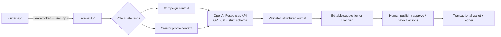

# Promo Zone AI

GPT-5.6 turns a rough product idea into an executable creator campaign, then
coaches creator drafts against the real brief—while people keep control of
publishing, approvals, and payouts.

**OpenAI Build Week 2026 · Work & Productivity**

[Live product and demo access](https://promozone.boldtechai.com) ·
[Android release](https://github.com/fuad1235/promo-zone-ai/releases/tag/v1.0.0-build-week) ·
[Direct APK download](https://github.com/fuad1235/promo-zone-ai/releases/download/v1.0.0-build-week/Promo-Zone-AI-Android-e84350e.apk)

Promo Zone AI is a Flutter and Laravel marketplace for small brands and content
creators. It combines two AI-assisted workflows with the operational system
needed to act on them: applications, proof review, ledger-backed credit holds,
and creator payouts.

## The problem

Small brands often start with an incomplete idea, not a creator-ready brief.
Creators then lose time clarifying requirements or discover after filming that
they missed a mention, hashtag, claim restriction, or deliverable. Generic
chatbots can produce copy, but they do not understand the live campaign or sit
inside the workflow where the work happens.

Promo Zone AI closes that gap:

1. **Campaign Architect** turns business context into an editable brief,
   guardrails, creator profile, success signal, hashtags, and three distinct
   content angles.
2. **Creator Coach** reviews a hook, caption, or script against the selected
   campaign and the authenticated creator's relevant profile context.
3. **Human-controlled workflow** keeps AI away from campaign publishing,
   creator approval, proof approval, wallet holds, and payout release.

## Build Week scope

Promo Zone existed before Build Week as a creator/business marketplace. The
existing baseline included authentication, campaign operations, applications,
submissions, and wallet accounting. It did **not** contain OpenAI integration or
AI-assisted workflows.

Everything after baseline commit `4fdbe4e` was built during this submission
effort:

- Laravel integration with the OpenAI Responses API and `gpt-5.6`.
- Strict JSON-schema output for both AI features.
- Role-protected, rate-limited AI endpoints.
- Campaign Architect and Creator Coach Flutter experiences.
- Prompt-injection boundaries, safe failures, token-usage metadata, and
  human-decision safeguards.
- AI feature tests, widget/model tests, Android runtime verification, and the
  Build Week submission package.

See the [pre-hackathon baseline](docs/build-week/PRE_HACKATHON_BASELINE.md) and
[Build Week changelog](docs/build-week/BUILD_WEEK_CHANGELOG.md) for the exact
boundary and commit evidence.

## How GPT-5.6 is used

The Laravel server calls `POST /v1/responses` with:

- `model: gpt-5.6`
- strict Structured Outputs through `text.format.type: json_schema`
- low reasoning effort for an interactive product experience
- `store: false`
- server-side API credentials only

Campaign Architect receives business-entered product facts, audience, goal,
platform, tone, and campaign values. Even if model output drifts, the server
overwrites platform, target views, payout, creator count, and brand mention
with the business-controlled inputs before returning the result.

Creator Coach loads the selected published campaign and authenticated creator's
profile, niches, metrics, and platform handle on the server. It returns a
0–100 coaching score, verdict, brief checklist, strengths, missing
requirements, risk flags, revised hook, revised draft, and shot list. The
result never changes workflow or financial state.

## Architecture



The OpenAI API key never enters Flutter. AI endpoints reuse the existing bearer
authentication, enforce business/creator roles before token spend, and return
safe `502`/`503` messages without exposing prompts, keys, or upstream payloads.

## Judge quick start

Prerequisites:

- Flutter 3.44+ and Dart 3.12+
- PHP 8.2+ and Composer
- Android emulator/device
- An OpenAI API key with access to GPT-5.6

### 1. Start the API

```bash
cd backend
composer install
cp .env.example .env
touch database/database.sqlite
php artisan key:generate
```

Add your key to the ignored `backend/.env` file:

```dotenv
OPENAI_API_KEY=your_server_side_key
OPENAI_MODEL=gpt-5.6
```

Then seed and serve:

```bash
php artisan migrate:fresh --seed
php artisan serve --no-reload
```

### 2. Run Flutter

```bash
flutter pub get
adb reverse tcp:8000 tcp:8000
flutter run --dart-define=LARAVEL_API_BASE_URL=http://127.0.0.1:8000
```

For a physical device, use the computer's LAN address instead of
`127.0.0.1`, or keep the USB reverse tunnel.

### 3. Follow the demo path

All seeded accounts use password `Password@123`.

| Role | Account | Demo path |
| --- | --- | --- |
| Business | `sparkbrew@promozone.test` | Work → Create → Build brief with GPT-5.6 |
| Creator | `ama.creator@promozone.test` | Browse → campaign → Creator Coach |

The [judge guide](docs/build-week/JUDGE_GUIDE.md) includes request examples,
expected results, test commands, and troubleshooting.

## Verification

```bash
flutter analyze
flutter test
```

Current result: **8 Flutter tests pass, with zero analyzer issues.**

```bash
cd backend
php artisan test
./vendor/bin/pint --test
```

Current result: **15 Laravel tests pass with 70 assertions**, including:

- structured GPT-5.6 Campaign Architect output;
- campaign + creator context in Creator Coach;
- role enforcement before OpenAI token spend;
- safe behavior when the server key is missing;
- transactional hold, payout, refund, and idempotency invariants.

Both new workflows were inspected from a clean Android debug build on an API
36.1 emulator. A production-targeted release APK was then built against the
verified HTTPS hostname, signature-checked, and inspected to confirm its final
label and HTTPS-only manifest. Artifact checksums are recorded in the judge
guide.

On July 18, 2026, both production AI endpoints were also exercised with real
authenticated requests. Campaign Architect and Creator Coach each returned
`200` with valid strict-schema output from the requested `gpt-5.6` model. The
server preserved the business-controlled campaign values, and coaching
returned a valid score, verdict, and campaign checklist.

The public product page provides the Android download, source, live API status,
demo credentials, and judge guide. The release asset was downloaded publicly
and matched the tested APK's size and SHA-256 exactly.

## Product stack

- Flutter, Material 3, Riverpod, GoRouter
- Laravel 12, bearer-token authentication, SQLite locally / MySQL in production
- OpenAI Responses API, GPT-5.6, strict Structured Outputs
- Transactional wallets, holds, immutable ledger entries, idempotency keys
- Laravel-hosted media uploads and seeded judge data

## Safety and privacy choices

- Treat business context, campaign text, creator profiles, and drafts as
  untrusted data inside prompts.
- Send only context needed for the requested feature.
- Set `store: false` on Responses API calls.
- Keep the API key server-side.
- Restrict AI calls by authenticated role and a dedicated 10/minute limiter.
- Never let model output publish campaigns, approve creators, validate proof,
  move balances, or release payouts.
- Preserve business-controlled numeric values after generation.
- Log feature, user, request ID, exception class, and safe message—not prompts
  or upstream response bodies.

## Documentation

- [Judge guide](docs/build-week/JUDGE_GUIDE.md)
- [Build Week changelog](docs/build-week/BUILD_WEEK_CHANGELOG.md)
- [Codex collaboration record](docs/build-week/CODEX_COLLABORATION.md)
- [Copy-ready Devpost submission](docs/build-week/DEVPOST_SUBMISSION.md)
- [Under-three-minute demo script](docs/build-week/DEMO_SCRIPT.md)
- [Submission checklist](docs/build-week/SUBMISSION_CHECKLIST.md)
- [OpenAPI contract](backend/docs/openapi.yaml)
- [Production release runbook](docs/release_runbook.md)

## License

Promo Zone AI is available under the [MIT License](LICENSE).

## Intentional MVP boundary

The wallet uses simulated credits and ledger-backed holds. Real Mobile Money or
bank settlement, payment webhooks, and identity verification are not included
in this hackathon build. The financial state machine is real application logic;
movement of external money is not.
